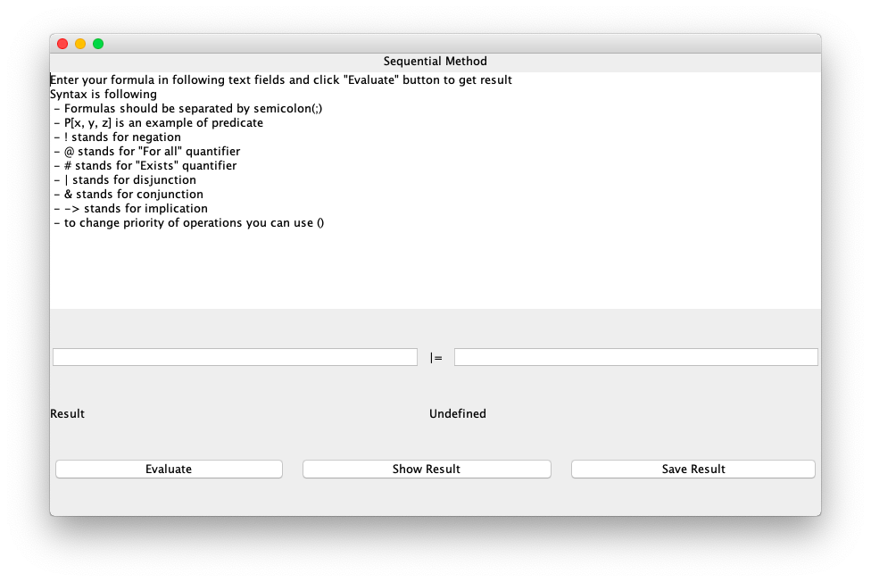
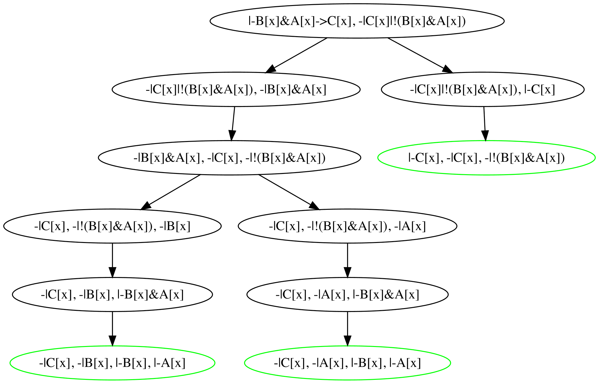
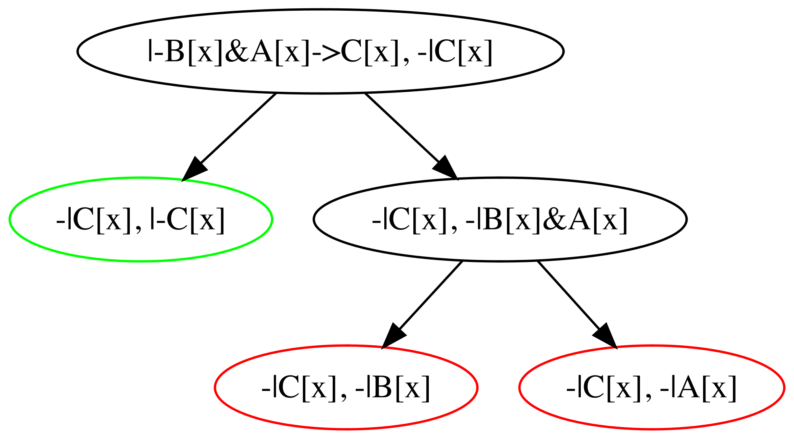

# Sequential Methdos

### Interface

Well, it is quite minimalistic: 

All you need is to type the formula you want to solve (using characters like `@`, `#` instead of $\forall$, $\exists$)

### Examples of output:

It could be like this:

Or like this:

It is not hard to understand what is the result of the above examples. So good luck in learning mathematical logic. Hope this project will help you to understand sequential methods (or Java, depends on your goal).
